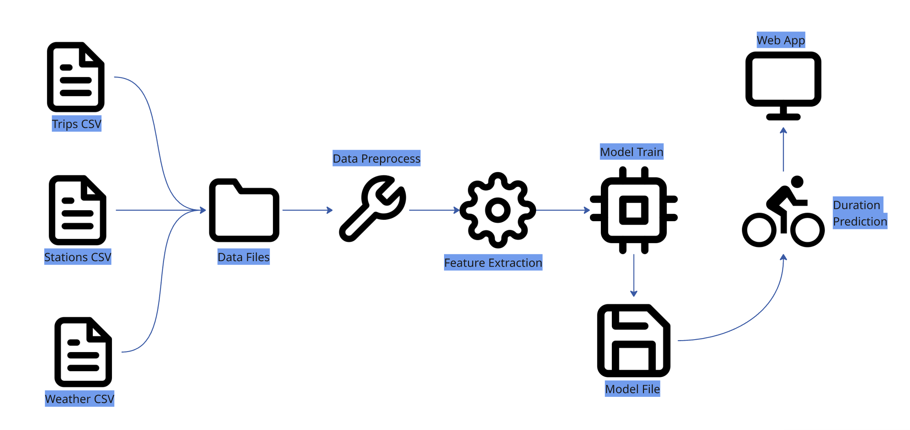

# BikeHub Trip Duration Prediction




A machine learning project to predict bike trip durations using historical data of stations, trips, and weather conditions.

## Project Overview

This project analyzes bike trip data and builds a model to predict trip durations based on various features like:
- Start/end station locations and distance
- Weather conditions (HPCP - precipitation)
- Temporal features (month, day of week, holidays, peak hours)
- User demographics (subscription type, gender, age)

## Features

- Interactive Streamlit web application
- Data exploration and visualization
- Machine learning model for trip duration prediction
- Distance calculation between bike stations
- Profile reports for data analysis


## Getting Started

- ```pip install -r requirements.txt```
- ```streamlit run app.py```


